# Italian Smocking

## Reference

This repository provides source codes for paper:

Ningfeng Zhou, [Jing Ren](https://ren-jing.com/), [Olga Sorkine-Hornung](https://igl.ethz.ch/people/sorkine). Computational Smocking through Fabric-Thread Interaction.

We formalize the Italian smocking pattern and develop a simple method to represent and deform the planar mesh into the smocked ones given the initial stitching lines.

More details can be found at:

## Implementation

The source code contains two stages:

1. 2D Simulation: estimate the expected position of critical points after smocking and prepare inputs for the downstream simulator. (detailed description in folder *sim2d*)
2. 3D Deformation: guide the simulator to deform the planar mesh into a plausible smocked one. (detailed description in folder *deform3d*)

## Our results

|     Pattern      |                             Rect                             |                            vwave                             |                            square                            |                            zcurve                            |
| :--------------: | :----------------------------------------------------------: | :----------------------------------------------------------: | :----------------------------------------------------------: | :----------------------------------------------------------: |
|    our result    | 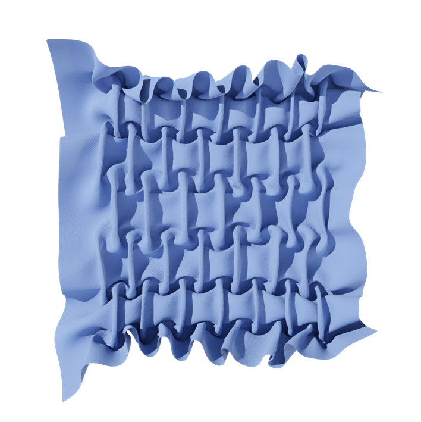 | 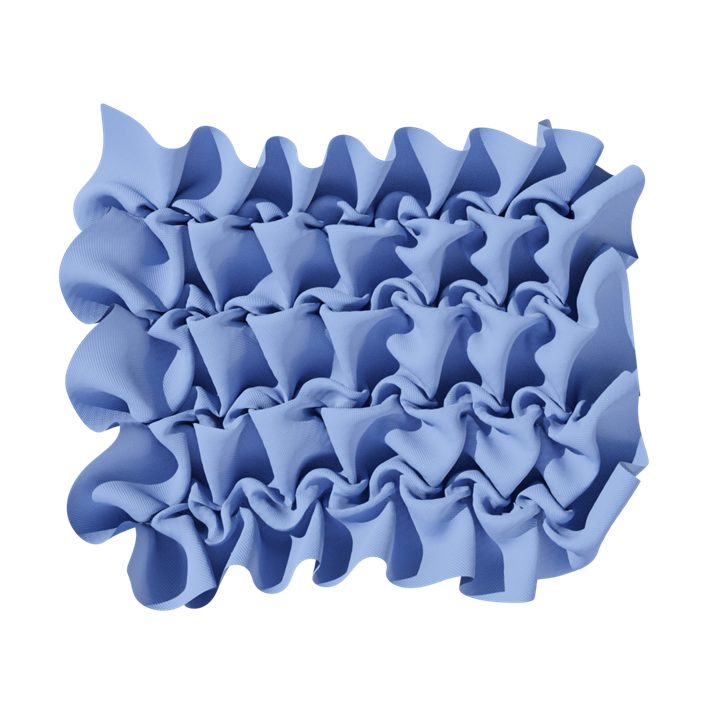 | 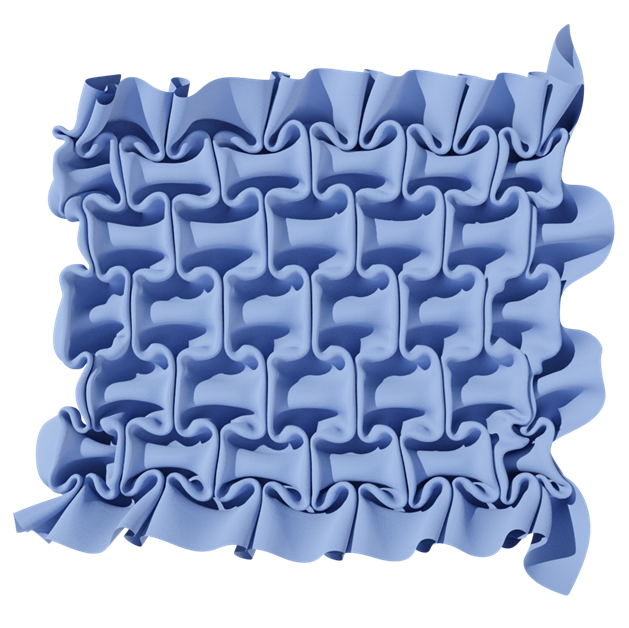 | 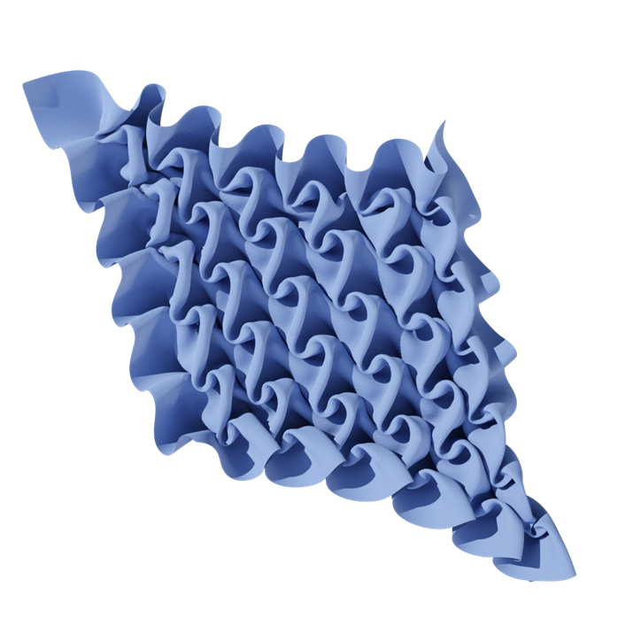 |
| real fabrication | 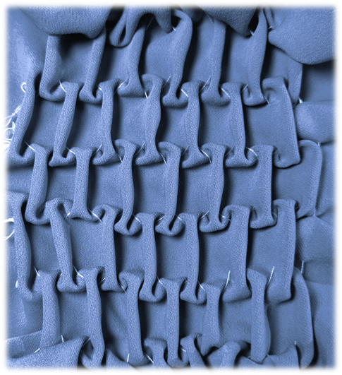 | 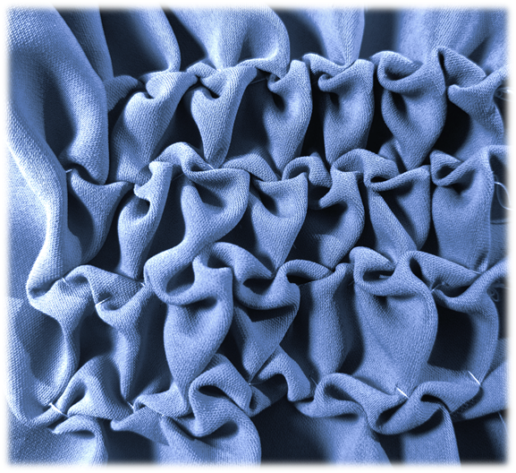 | 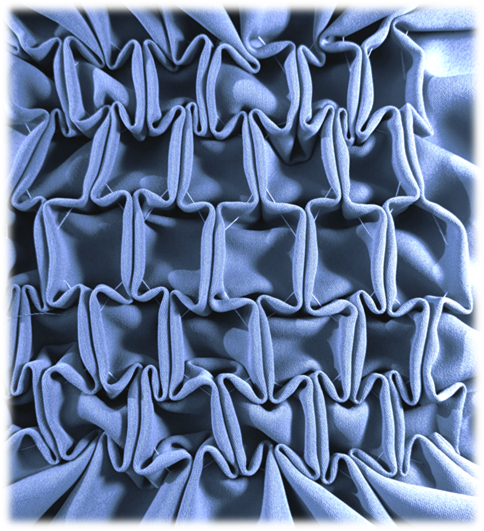 | 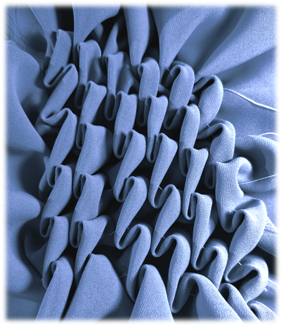 |

|     Pattern      |                            zigzag                            |                          half sharp                          |                        sharp (layer2)                        |                            curve                             |
| :--------------: | :----------------------------------------------------------: | :----------------------------------------------------------: | :----------------------------------------------------------: | :----------------------------------------------------------: |
|    our result    | 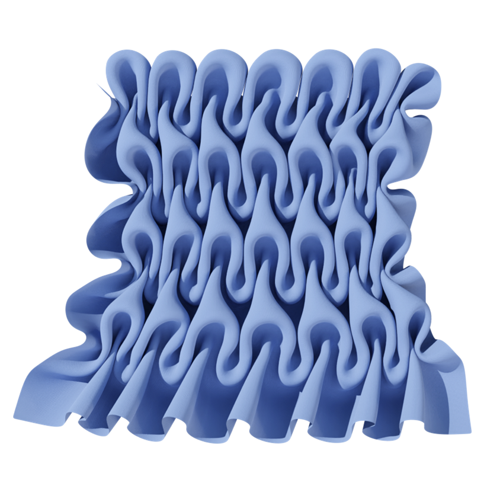 | 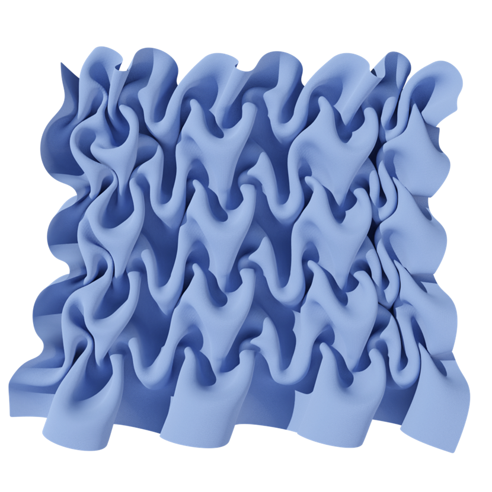 | 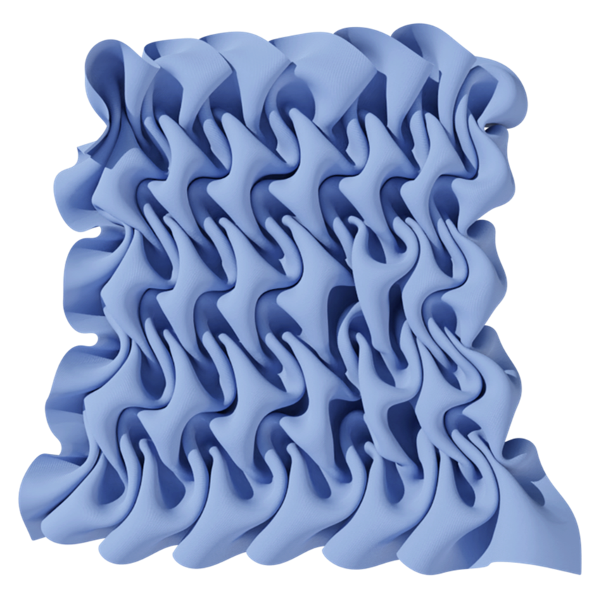 | 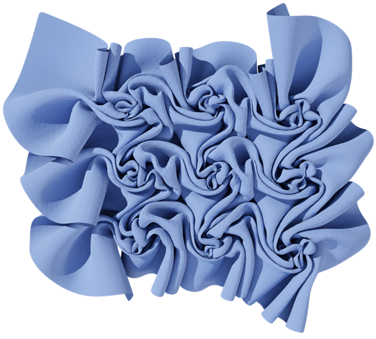 |
| real fabrication | 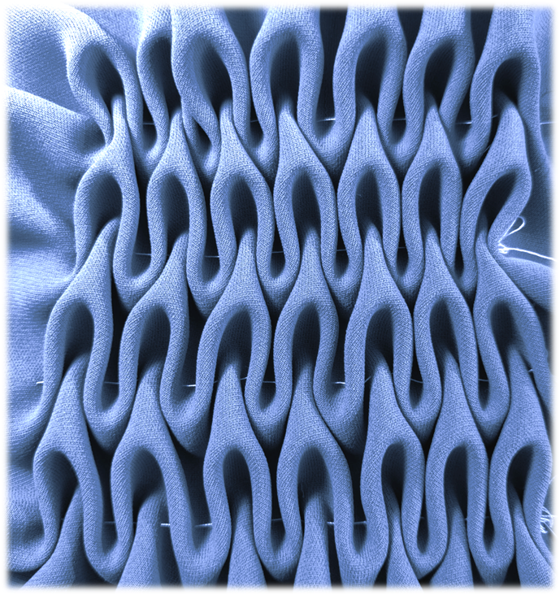 | 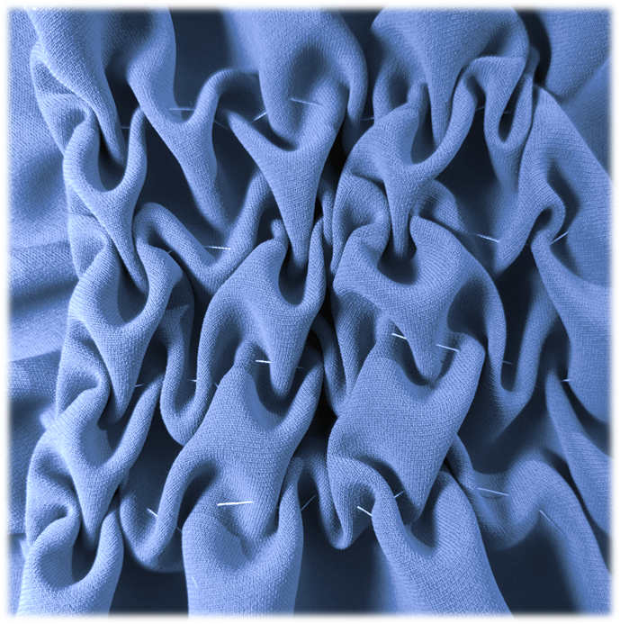 | 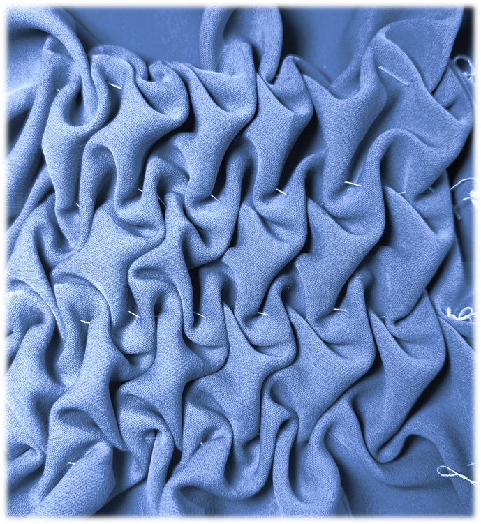 | 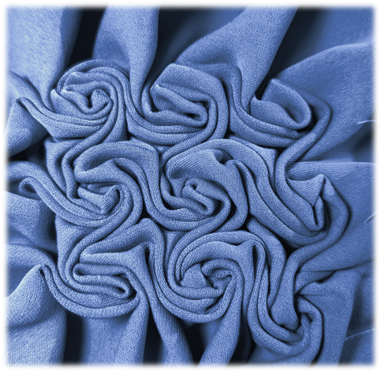 |

## Notes

TBD

