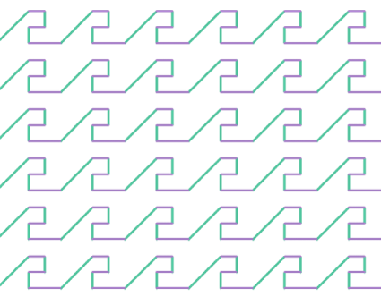

# Italian Smocking

## Reference

This repository provides source codes for paper:

[Ningfeng Zhou](https://github.com/nifzhou), [Jing Ren](https://ren-jing.com/), [Olga Sorkine-Hornung](https://igl.ethz.ch/people/sorkine). Computational Smocking through Fabric-Thread Interaction.

We formalize the Italian smocking pattern and develop a simple method to represent and deform the planar mesh into the smocked ones given the initial stitching lines.

More details can be found at: [project page], [paper], [[suppl. video]](https://youtu.be/L6AdmSCmbFc).

## Implementation

The source code contains two stages:

1. 2D Simulation: estimate the expected position of critical points after smocking and prepare inputs for the downstream simulator. (detailed description in folder *sim2d*)
2. 3D Deformation: guide the simulator to deform the planar mesh into a plausible smocked one. (detailed description in folder *deform3d*)

## Our results

|     Pattern      |                             Rect                             |                            vwave                             |                            square                            |                            zcurve                            |
| :--------------: | :----------------------------------------------------------: | :----------------------------------------------------------: | :----------------------------------------------------------: | :----------------------------------------------------------: |
|   input stitch   |                                    |                                  |                                |                                |
|    our result    |  |  |  |  |
| real fabrication |  |  |  |  |

|        Pattern         |                            zigzag                            |                          half sharp                          |                        sharp (layer2)                        |                            curve                             |
| :--------------------: | :----------------------------------------------------------: | :----------------------------------------------------------: | :----------------------------------------------------------: | :----------------------------------------------------------: |
| input stitch (partial) |                      |                      |                      |                                  |
|       our result       |  |  |  |  |
|    real fabrication    |  |  |  |  |

## Notes

### Acknowledgements

We would like to thank the anonymous reviewers for their insightful feedback. We extend our gratitude to M. Rifad (YouTube channel ``DIY Stitching``), F. Shanas (YouTube channel ``handiworks``), and S. Fyms (YouTube channel ``FymsEmbroidery``) for generously granting us permission to use the images of their remarkable fabrication results.
This work was supported in part by the ERC Consolidator Grant No.101003104 (MYCLOTH).

